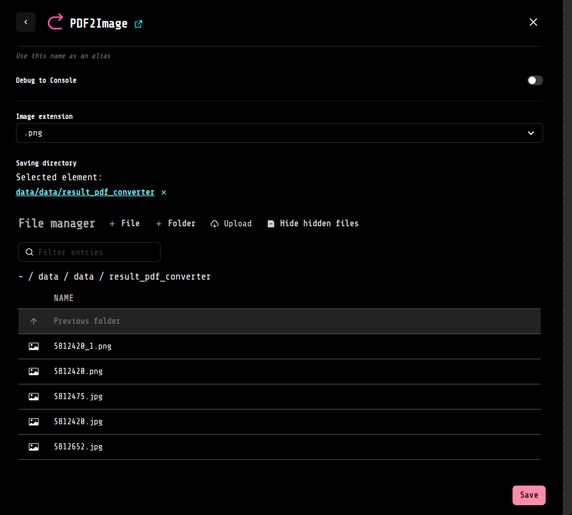
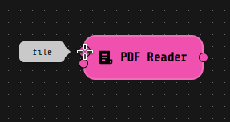
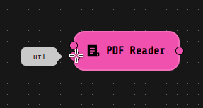

# Loko-utils-ext
This LOKO AI extension contains several blocks with miscellaneus purpose:

- [PDF2Image](#pdf2image)
- [PDF Reader](#pdfreader)

# <a name="pdf2image">_PDF2Image_ </a>

The **PDF2Image** component allows to convert a pdf file into an image file. The converted file will have the same filename, to which will be add the relative page number of the pdf converted, and the file extensions of the image chosen.
For instance, if your file it's called "file.pdf" and you contains only 1 page, then the new file, supposing we are saving it as ".png", will be saved as "file_1.png". 

## Settings

In the *"Image extension"* field select the extension that you want to us for the image, the default value is *".png"*.
In the *"Saving directory"* field select the directory in which you want to save the resulting file.

# <a name="pdfreader">_PDF Reader_ </a>

This component helps you reading textual content from a Machine Readable pdf.

The two input pins allow to extract the content both from a url and file, which can be read with a File Reader block.

  
  

# How to use it
In case your file is available online and you don't want to download it, you can directly pass the url address as a string directly linking the flow to the **"url" input pin** of the PDF Reader component. For example, you may use a Trigger component, with "String" as Type, typing or pasting the url of interest in the "Value" field and then link it to the right input pin of the PDF Reader.

Otherwise, if the file you need to extract the content from is directly available on your computer, then you can link for instance a File Reader block, with the "Read content" field untoggled, to the **"file" pin input**.